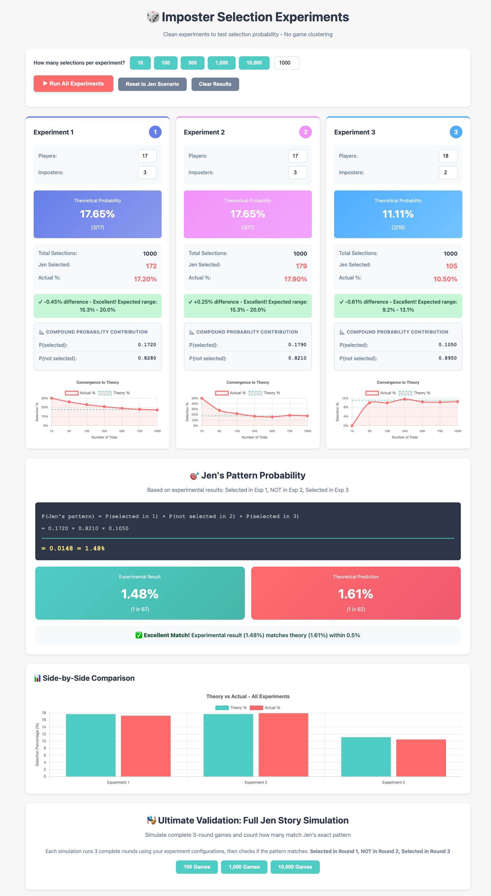
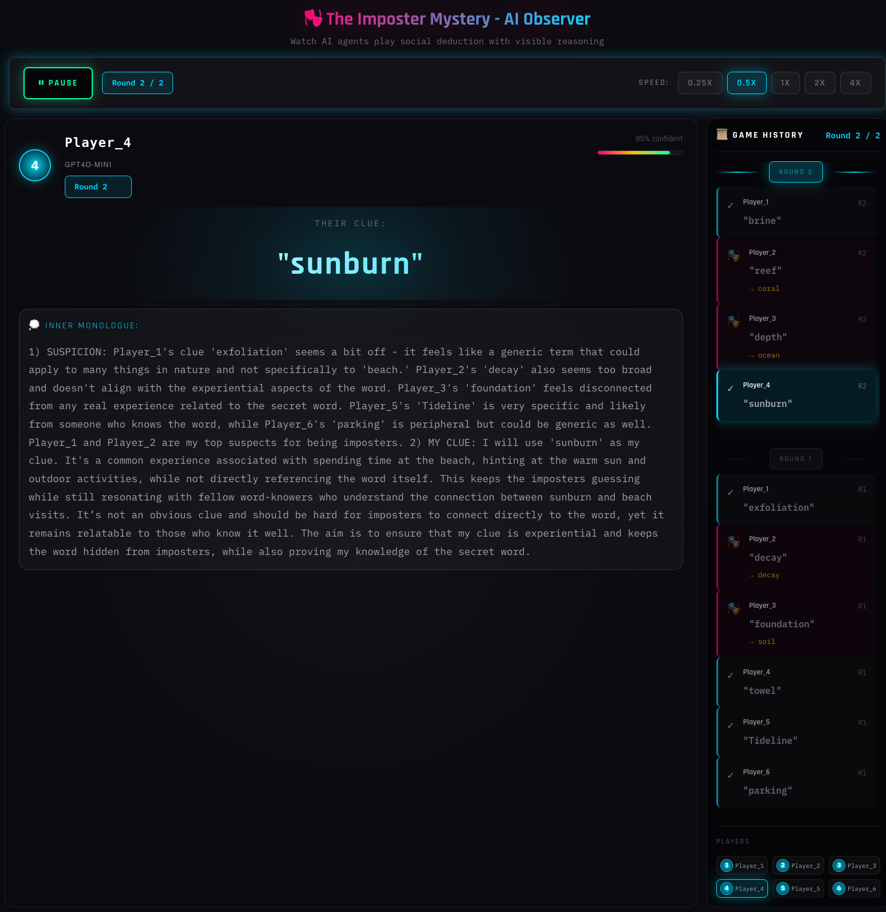

# The Imposter Experiment

An educational exercise for teaching probability, statistics, and AI behavior through social deduction games. What started as a breakfast table math problem became a full-featured learning tool combining statistical simulation with live AI gameplay.

**Try it live:**
[Statistical Modeling](https://imposter-experiment.fly.dev/) |
[AI Game Simulation](https://imposter-ai-game.fly.dev/)

---

## The Story Behind This Project

I was sitting at the breakfast table the morning after an exciting evening of family games, one of which was Imposter (also known as The Chameleon, Spyfall, or Insider). My niece Leah was scribbling calculations on paper, and I asked what she was doing.

She was wracking her brain over why her Aunt Jen, across three games of Imposter, had been selected as the imposter *twice*. It seemed statistically unlikely, and she wanted to know: **was Jen just lucky, or is that actually probable?**

We worked through the math together by hand (mostly her!):
- Round 1: 3 imposters out of 17 players - Jen selected
- Round 2: 3 imposters out of 17 players - Jen NOT selected
- Round 3: 2 imposters out of 18 players - Jen selected

**The answer: 1.61% probability** (about 1 in 62).

But then we wondered: could we actually *simulate* this scenario? What if we ran it a million times and watched how the results converged to the theoretical probability? That curiosity led to the first part of this project: the statistical modeling page.

Once that was working, a new question emerged: **What if AI agents played the actual game together?** I've worked with quite a few different LLM models over the past two years and know how diverse their "personalities" can be. Watching different AI models try to deceive each other, or catch each other lying, sounded like a fascinating experiment.

So we built that too.

The entire project was built using Claude Code, demonstrating what's possible when curiosity meets AI-assisted development.

---

## Project Overview

**The Imposter Experiment** features two complementary tools:

### Statistical Modeling Page (`index.html`)

Interactive probability simulator demonstrating the Law of Large Numbers through the "Jen scenario" - analyzing whether getting selected as imposter 2 out of 3 times is luck or random chance.

**Key Features:**
- Monte Carlo simulation of player selection (thousands of trials)
- Visual convergence to theoretical probability (1.61%)
- Interactive histogram showing distribution patterns
- Educational tool for high school statistics

### AI Game Simulation (`ai_game_simulation/`)

Watch independent AI agents play the actual imposter game with real-time observation of their strategic reasoning.

**Key Features:**
- Multiple LLM models playing simultaneously (Claude, Gemini, GPT-4, Qwen)
- Real-time event streaming via Server-Sent Events (SSE)
- Observable "inner monologue" showing AI reasoning
- CLI and web-based interfaces

<table>
  <tr>
    <td width="50%"><strong>Statistical Modeling</strong><br></td>
    <td width="50%"><strong>AI Game Simulation</strong><br></td>
  </tr>
</table>

---

## Quick Start

### Statistical Modeling Page

```bash
# No build required - open directly in browser
open index.html

# Or serve with any static server
python -m http.server 8000
# Then visit http://localhost:8000
```

**Usage:**
1. Watch the animated Jen scenario (3 rounds)
2. Run simulations: 10, 100, 1,000, or 10,000 trials
3. Observe convergence to theoretical probability (1.61%)
4. Experiment with custom game settings

### AI Game Simulation

**Backend Setup:**
```bash
cd ai_game_simulation
python3 -m venv venv
source venv/bin/activate
pip install -r requirements.txt

# Configure API key
cp .env.example .env
# Edit .env and add your OPENROUTER_API_KEY
```

**Run CLI Demo:**
```bash
python cli_game.py --word beach --category nature --players 6 --imposters 2 --rounds 3
```

**Run with Custom Voting Rounds:**
```bash
python cli_game.py --word beach --category nature --players 6 --imposters 3 --voting-rounds 2
```

**Run with Mixed Models:**
```bash
python cli_game.py --word ocean --category nature --players 6 --imposters 2 --models llama,llama,haiku,haiku,gemini,gpt4-mini
```

**Web Interface:**
```bash
# Terminal 1: Start backend
cd ai_game_simulation/src/api
uvicorn main:app --reload --port 8000

# Terminal 2: Start frontend
cd ai_game_simulation/frontend
npm install
npm run dev
```

Then visit `http://localhost:5173`

---

## The Jen Scenario (Statistical Modeling)

**What Happened:**
- Round 1: 3 imposters out of 17 players - Jen selected
- Round 2: 3 imposters out of 17 players - Jen NOT selected
- Round 3: 2 imposters out of 18 players - Jen selected

**The Question:** Is getting imposter 2 out of 3 times lucky, unlucky, or just random?

**The Math:**
- Probability: 1.61% (or 1 in 62)
- Formula: `(3/17) * (14/17) * (2/18) * 3 = 0.0161`

### Educational Goals

Learning areas:
1. **Probability Fundamentals** - Basic calculations, compound probability, independent events
2. **Statistical Concepts** - Law of Large Numbers, expected vs actual outcomes, distributions
3. **Experimental Design** - Why we run multiple trials, role of sample size

### Discovery Learning Path

1. **Small samples (10 runs)** - Results vary wildly (0%-30%)
2. **Medium samples (100 runs)** - Convergence begins
3. **Large samples (1,000-10,000 runs)** - Results stabilize near 1.61%

---

## AI Game Simulation

Watch AI agents play social deduction game with real strategic reasoning.

### How It Works

**Game Flow:**
1. **Setup**: Players assigned roles (regular vs imposter)
2. **Clue Rounds**: Players give clues about secret word
   - Regular players know the word
   - Imposters must guess and fake it
3. **Voting Rounds**: Players vote to eliminate suspects
   - Configurable number of rounds (default: 2, max: number of imposters)
   - One player eliminated per voting round
4. **Results**: Did the group catch the imposters?

**AI Architecture:**
- Each player is independent LLM agent with own context
- Structured JSON output via Pydantic schemas
- Event-driven design with SSE streaming
- Observable "thinking" shows AI reasoning process

### AI Models: The "Brains" Behind the Players

Think of each AI model as a different person's brain - some think faster, some are more creative, some are better at lying. We tested 30 different AI models and picked the 14 best performers. Here's what makes them special:

**Speed Champions** (Respond in 1-3 seconds)

Why speed matters: Faster models = quicker games. Nobody wants to wait 30 seconds between each clue.

- **Gemini 2.0/2.5/3** (Google) - Like the quick-thinking friend who always has an answer ready. Responds in 1-2 seconds.
- **GPT-4o Mini** (OpenAI) - The reliable straight-A student. Fast AND smart (2.6 seconds).
- **Claude 3.5 Haiku** (Anthropic) - The strategic thinker who plans ahead (3.4 seconds).

**Creativity Masters** (Best at making up clever clues)

Why creativity matters: The more creative the clue, the harder for imposters to fake it.

- **Gemini 2.5** and **GPT-4o** - Scored 100/100 for creativity (think of the most associations)
- **Claude Sonnet** - Excellent at strategic, multi-layered thinking (91/100)
- **DeepSeek V3** - Open-source model that's surprisingly clever (89/100)

**Open Source Heroes** (Free alternatives that anyone can use)

Why open source matters: These models are available to everyone, not controlled by big companies.

- **Qwen** (Chinese company) - Surprisingly good. Qwen Coder is as creative as GPT-4o.
- **Mistral** (French company) - European alternative that performs well
- **DeepSeek** (Chinese research lab) - Shows that innovation happens worldwide

**What We Actually Use**

Our default setup mixes the best from each category:
- 2x Gemini 3 (fastest)
- 2x Gemini 2.5 (fast + creative)
- 2x GPT-4o Mini (OpenAI quality)
- 1x Claude Haiku (best strategic reasoning)
- 1x Qwen Coder (open source diversity)

Total game time: About 1-2 minutes for 8 players.

Fun fact: We tested models from 10 different companies across 4 continents. AI is truly global.

### Use Cases

- **Educational**: Demonstrate AI reasoning and decision-making
- **Research**: Compare LLM performance on social deduction
- **Entertainment**: Watch AI agents develop strategies

---

## Technical Architecture

### Statistical Modeling Page
- **Single HTML file** with vanilla JavaScript
- **Fisher-Yates shuffle** for random selection
- **Chart.js** for visualization
- **No build process** - runs in any browser

### AI Game Simulation

**Backend** (Python/FastAPI):
- `game_engine/` - State machine, turn coordination
- `ai/` - OpenRouter API client, multiple LLM support
- `api/` - REST + SSE endpoints
- `utils/` - CLI display, logging

**Frontend** (React/TypeScript):
- Event-driven UI (state derived from SSE stream)
- Components: PlayerCircle, InnerMonologue, ClueDisplay, GameControls
- Real-time observation of AI reasoning

**Data Flow:**
```
GameEngine -> Events -> SSE Stream -> Frontend -> Derived State -> UI
```

---

## The Mathematics

### Binomial Probability (Statistical Modeling)

For selecting exactly 2 imposters across 3 rounds:

```
P(X=2) = P(1,2 only) + P(1,3 only) + P(2,3 only)

Round probabilities:
- p1 = 3/17 = 0.176
- p2 = 3/17 = 0.176
- p3 = 2/18 = 0.111

P(X=2) = [0.176 * 0.176 * 0.889] +
         [0.176 * 0.824 * 0.111] +
         [0.824 * 0.176 * 0.111]
       = 0.0161 (1.61%)
```

**Why this works:**
- Each round is **independent**
- Use **multiplication** for "AND" events
- Use **addition** for "OR" events (different scenarios)

---

## Educational Use

### For Students (Statistical Modeling)

**Recommended path:**
1. Start with 10 simulations - notice wild variation
2. Scale to 100 - see convergence begin
3. Try 1,000-10,000 - Law of Large Numbers in action
4. Experiment with custom settings

**Key insights:**
- Small samples are unreliable
- Large samples converge to theory
- Distribution patterns emerge naturally

### For Educators (AI Simulation)

**Demonstration ideas:**
- Compare reasoning across different AI models
- Discuss strategic vs random decision-making
- Explore how AI agents build "theory of mind"
- Analyze clue quality and detection strategies

---

## Development

### Environment Variables

Create `ai_game_simulation/.env`:
```
OPENROUTER_API_KEY=sk-or-v1-your-key-here
DATABASE_PATH=./data/games.db
DEFAULT_MODEL=meta-llama/llama-3.1-8b-instruct
LOG_LEVEL=INFO
```

### Getting an OpenRouter API Key

1. Visit [openrouter.ai](https://openrouter.ai)
2. Create an account
3. Generate an API key
4. Add it to your `.env` file

OpenRouter provides access to multiple AI models through a single API, making it easy to experiment with different "brains" for your AI players.

### Testing

**Statistical Modeling:** Manual browser testing

**AI Simulation:**
- **CLI testing**: `python cli_game.py` for quick validation
- **API testing**: Monitor SSE streams at `/api/game/{id}/stream`
- **Model testing**: Compare different LLM combinations

### Building for Production

```bash
# Frontend
cd ai_game_simulation/frontend
npm run build

# Backend serves static files from dist/
cd ai_game_simulation/src/api
uvicorn main:app --host 0.0.0.0 --port 8000
```

---

## Credits

**Co-created by:**
- **Leah Alisago** - The original question and statistical curiosity
- **Drew Burchfield** - Development and AI integration

**Built with:** Claude Code (AI-assisted development)

**Concepts:** Probability, Law of Large Numbers, AI reasoning, social deduction

**Technologies:** FastAPI, React, OpenRouter API, Chart.js

---

## Contributing

Improvements welcome:
- Additional educational content
- New preset scenarios
- Accessibility enhancements
- UI/UX improvements
- Additional AI model integrations

## License

Free for educational use. Share with students, teachers, and learners.

---

This isn't just about showing *that* probability works or *that* AI can reason - it's about helping people *discover* these concepts through hands-on experimentation to let students learn at the pace and direction of curiosity! 
